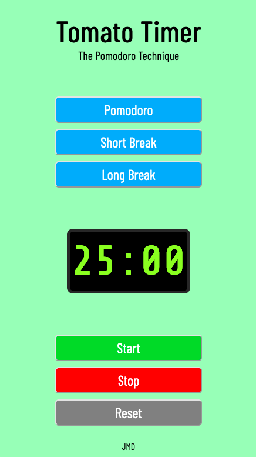

# tomato-timer

The classic tomato timer, a [Pomodoro Technique](https://en.wikipedia.org/wiki/Pomodoro_Technique). This was a fun mini project that introduced me to the setInterval functionality.

I use the tomato timer daily to assist in staying focused and to take quick breaks to stretch the legs and help reset the mind. It helps to break up the day, and tackle bigger projects.

I was inspired to build an app similar to the website; [Tomato-Timer.com](https://tomato-timer.com/)!

## Table of Contents

- [Overview](#overview)
    - [App Breakdown](#app-breakdown)
    - [Screenshot](#screenshot) 
    - [Links](#links) 
- [My Process](#my-process)
    - [Built With](#built-with)
    - [What I Learned](#what-i-learned)
    - [Continued Development](#continued-development)
    - [Useful Resources](#useful-resources)

### Overview

#### App Breakdown

This application is a coundown timer that assists those using the [Pomodoro Technique](https://en.wikipedia.org/wiki/Pomodoro_Technique). 

The app gives you the choice to set the timer to either 25 minutes, or a series of breaks, 10 minutes for a long break, or 5 minutes for a short break.

You can also stop the timer at anytime, re-start the timer, or reset the timer to begin the countdown again.

#### Screenshot

#### Links

- [Live View](https://johnmichaeld.github.io/tomato-timer/)
- [Github Repository](https://github.com/JohnMichaelD/tomato-timer)
- [Website](johnmdarrin.com)

### My Process

#### Built With

- Javascript ES6
- HTML5
- CSS3
- Adobe XD
- Mobile First Design

#### What I Learned

- JS Timer Functionality 
- [Webkit](https://webkit.org/)
- timer in js
- setInterval()
    Calling setInterval in multiple functions did not work, it would multiple the interval count each time it was called, which makes sense, but was not the solution i was hoping for. 

    at a point, clicking 'start' when the timer was already counting down, would accelerate the countdown, multiplied by each click, 'stop' would no longer work, and reset would work, but the countdown would still be as fast.

    removed initial decleration of setInterval, only in start function now
        - fixed stop not working, did not fix speed

- setTimeout()
- clearInterval()
    - I was able to use clearInterval() to pause the timer. 

#### Continued Development

This was a great project, and I truly learned a lot!

I would like to come back to this project and add sound for when the alarm hits 00:00.

I would also like to practice a bit on my CSS skills, and make the clock look more like a [retro 90's alarm clock](https://pictures.depop.com/b0/6331641/496631841_Vz5Zqg9wdm/P0.jpg)!

#### Useful Resources

- [CSS Animations](https://www.youtube.com/watch?v=MLtAMg9_Svw)
- [Query Selector](https://developer.mozilla.org/en-US/docs/Web/API/Document/querySelector#escaping_special_characters)
- [JS Timer](https://stackoverflow.com/questions/31559469/how-to-create-a-simple-javascript-timer)
- [setTimeout()](https://www.sitepoint.com/delay-sleep-pause-wait/)
- [setTimeout()](https://stackoverflow.com/questions/8539079/how-to-start-and-stop-pause-setinterval)
- [clearInterval()](https://www.w3schools.com/jsref/met_win_clearinterval.asp)

### Author

- [John M Darrin - Website](johnmdarrin.com)
- Reference: [tomatoTimer.com](https://tomato-timer.com/)